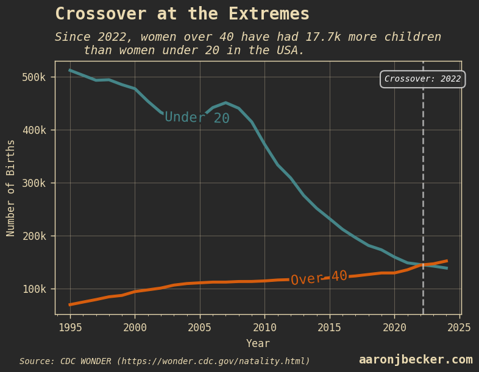

# Testing Markdown Image Syntax

This post tests markdown image syntax `` in mdsvex files when `convertMarkdownSyntax` is enabled.

The image above should be automatically converted to an optimized picture element.
